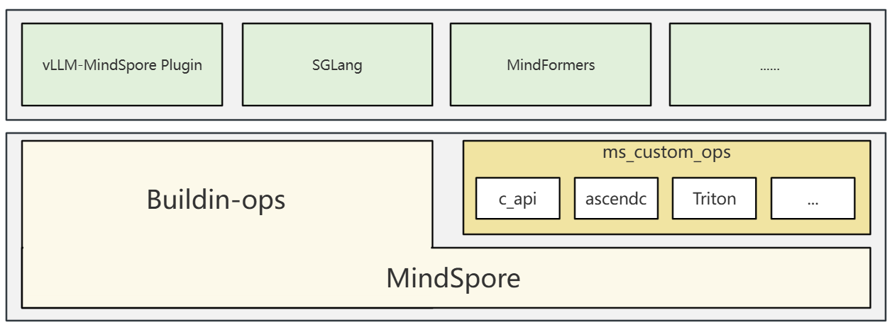

# MindSpore自定义算子扩展 (ms_custom_ops)

中文版 | [English](README_EN.md)

## 项目简介

MindSpore 自定义算子扩展（ms_custom_ops），是依托 MindSpore 原生的自定义算子与自定义 pass 能力构建而成的独立算子扩展插件包。其核心定位在于为大模型等前沿 AI 领域模型，提供关键的高性能算子支撑，助力模型突破计算效率瓶颈；在算子接入上，该插件包具备极强的灵活度，可全面覆盖各类第三方算子库、AscendC 算子、Triton DSL 等多种技术路径的算子类型，充分满足不同研发场景下的算子集成需求，为 AI 模型的高效迭代提供底层保障。

<div align="center">
  
</div>

## 目录结构

```
ms_custom_ops/
├── CMakeLists.txt        # CMake构建配置
├── README.md             # 项目文档
├── README_EN.md          # 英文项目文档
├── OWNERS                # 项目维护者
├── LICENSE               # 开源许可证
├── requirements.txt      # Python依赖
├── setup.py              # Python包配置
├── version.txt           # 版本信息
├── 3rdparty/             # 第三方依赖
├── cmake/                # CMake构建脚本
├── docs/                 # 文档资源
├── ops/                  # 自定义算子kernel源码与接入代码
│   ├── ascendc/          # AscendC算子实现以及对接代码
│   ├── c_api/            # 以预封装的API调用方式对接的算子
│   ├── framework/        # 算子对接公共代码
│   └── dsl/              # DSL（Domain Specific Language）算子源码
├── pass/                 # 自定义融合pass
├── prebuild/             # 预编译的二进制库
├── python/               # Python绑定和扩展
├── scripts/              # 构建和工具脚本
└── tests/                # 测试用例
```

## 快速开始

### 前置条件

- **Python**: >= 3.9
- **MindSpore**: >= 2.7.1
- **华为昇腾软件**: CANN toolkit >= 8.3.RC1
- **编译器**: GCC 7.3 或更高版本
- **CMake**: 3.16 或更高版本
- **Ninja**: 1.11 或更高版本

### 环境设置

1. **安装华为昇腾CANN工具包**:  
   从[华为昇腾官网](https://www.hiascend.com/developer/download/community/result?module=cann)下载并安装CANN工具包

2. **设置昇腾环境**:
   ```bash
   export ASCEND_HOME_PATH=${YOUR_INSTALL_PATH}$/ascend-toolkit/latest
   source ${ASCEND_HOME_PATH}/../set_env.sh
   ```

3. **安装MindSpore**:  
   从[MindSpore官网](https://www.mindspore.cn/install)获取下载并安装

### 编译与安装

1. **克隆仓库**:
   ```bash
   git clone https://gitee.com/mindspore/ms-custom-ops.git
   cd ms_custom_ops
   ```

2. **安装Python依赖**:
   ```bash
   pip install -r requirements.txt
   ```

3. **使用 build.sh 脚本（推荐）**:

   ```bash
   # 查看编译选项
   bash scripts/build.sh -h
   
   # 默认编译（Release模式）
   bash scripts/build.sh
   
   # Debug编译
   bash scripts/build.sh -d
   
   # 编译指定算子
   bash scripts/build.sh -p ${absolute_op_dir_path}
   
   # 编译指定算子
   bash scripts/build.sh -p ${absolute_op_dir_path}
   eg. bash scripts/build.sh -p /home/ms_custom_ops/ccsrc/ops/ascendc/add,/home/ms_custom_ops/ccsrc/ops/ascendc/add
   
   # 指定SOC Verison编译
   eg. bash scripts/build.sh -v ascend910b4
   ```

   编译完成后，安装生成的wheel包：
   ```bash
   pip install dist/*.whl
   ```

4. **使用 setup.py 安装**

   ```bash
   # 安装（会自动编译自定义算子）
   python setup.py install
   
   # 或者构建wheel包
   python setup.py bdist_wheel
   ```

## 基本用法

   安装后，您可以在MindSpore代码中使用自定义算子：

   ```python
   import mindspore as ms
   import ms_custom_ops
   
   # 自定义算子的使用示例（实际API可能有所不同）
   # result = ms_custom_ops.some_custom_operation(input_tensor)
   ```

## 参考文档
- [MindSpore教程](https://www.mindspore.cn/tutorials/zh-CN/r2.7.0/index.html)
- [MindSpore自定义编程](https://www.mindspore.cn/tutorials/zh-CN/r2.7.0/custom_program/op_custom.html)
- [AscendC编程](https://www.hiascend.com/cann/ascend-c)

## 贡献

我们欢迎对此项目的贡献。请参阅[CONTRIBUTING.md](https://www.mindspore.cn/vllm_mindspore/docs/zh-CN/master/developer_guide/contributing.html)文件了解如何贡献的指南。
我们欢迎并重视任何形式的贡献与合作，请通过Issue来告知我们您遇到的任何Bug，或提交您的特性需求、改进建议、技术方案。